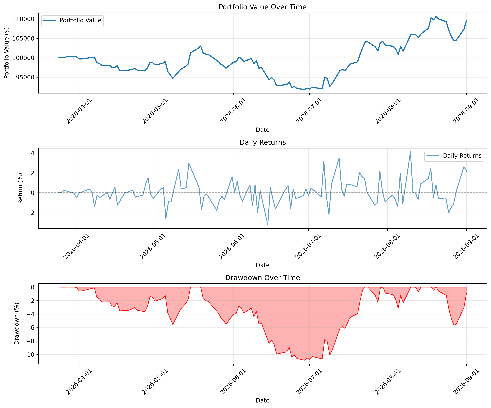
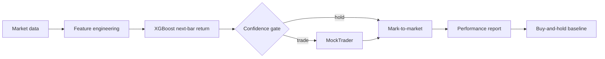

# Quant Trading Backtester

[](LICENSE)
[]()
[](tests/)

> End-to-end quantitative trading research pipeline: market data → features → XGBoost signals → commission-aware simulation → risk metrics **vs buy-and-hold**.

**One-command demo (no API key):**

```bash
pip install -r requirements.txt
python main.py demo --plot
```

---

## Why this project exists

Most “algo trading” GitHub repos train on the full history, skip transaction costs, and report Sharpe with the wrong annualization. This repo is built to be **interview-defensible**:

| Practice | What we do |
|----------|------------|
| Time-series split | Chronological train/test only |
| Label leakage | Embargo / purge gap between train and test |
| Evaluation | Backtest **only** on the held-out window |
| Baseline | Buy-and-hold on the **same** window + commission |
| Risk metrics | Sharpe/Sortino/vol use **bar-frequency-aware** annualization |
| Features | Metadata / raw OHLC excluded from the model matrix |

See [docs/methodology.md](docs/methodology.md) for the full design notes.

---

## Sample held-out results (demo run)

Reproduced with `python main.py demo --period 2y` on AAPL / MSFT / GOOGL / JPM / XOM (daily bars via Yahoo Finance). Evaluation window ≈ Feb 2026 → Sep 2026.

| Ticker | Strategy return | Buy & hold | Excess vs B&H | Sharpe | Max DD | Dir. hit rate | Trades |
|--------|-----------------|------------|---------------|--------|--------|---------------|--------|
| AAPL | 0.00% | 18.61% | −18.61% | 0.00 | 0.00% | 48.9% | 0 |
| MSFT | 0.91% | 25.41% | −24.50% | 1.25 | 0.51% | 51.1% | 12 |
| GOOGL | 0.77% | 7.09% | −6.32% | 1.39 | 0.96% | 51.9% | 17 |
| JPM | 1.54% | 18.01% | −16.47% | 2.45 | 0.52% | 51.9% | 8 |
| XOM | 9.64% | 11.75% | −2.10% | 1.15 | 10.84% | 53.4% | 59 |

**Takeaway for recruiters:** out-of-sample next-day return models on liquid large-caps are hard — hit rates hover near 50% and the strategy often **underperforms buy-and-hold**. That is expected. The showcase is the **evaluation discipline**, not fabricated alpha.

Full JSON: [`docs/sample_results/latest_demo_summary.json`](docs/sample_results/latest_demo_summary.json) · equity plots in `docs/sample_results/`.



---

## Architecture

```text
Data Layer          Signal Engine           Execution              Analytics
-----------         -------------           ---------              ---------
yfinance daily  →   technical features  →   MockTrader         →   Sharpe / Sortino
Polygon minute  →   XGBoost return pred →   commission fills   →   max drawdown
checkpointed ETL →  confidence gate     →   position sizing    →   vs buy-and-hold
```



---

## Quick start

### 1. Setup

```bash
git clone https://github.com/ShamikOfficial/quant-trading-backtester.git
cd quant-trading-backtester
python -m venv .venv

# Windows PowerShell
.\.venv\Scripts\Activate.ps1

# macOS / Linux
# source .venv/bin/activate

pip install -r requirements.txt
```

### 2. Run the demo (recommended)

```bash
python main.py demo --plot
# or: python run_demo.py --plot
```

This will:

1. Download ~2y of daily OHLCV for 5 liquid tickers (no API key)
2. Engineer technical features
3. Train per-ticker XGBoost with a **70/30 chronological split + embargo**
4. Backtest **only** on the held-out window
5. Compare each ticker to buy-and-hold
6. Write `docs/sample_results/latest_demo_summary.json` (+ optional plots)

### 3. Run tests

```bash
pytest -q
```

---

## Advanced: Polygon minute-bar pipeline

For higher-frequency research (original course/lab path):

```bash
cp .env.example .env   # set API_BASE + API_KEY

# Sector-balanced S&P selection
python src/stock_selector.py --n-stocks 20 --output-dir data/selections

# Collect + process with checkpoint/resume
python run_data_collection.py --full \
  --selection-file data/selections/selected_stocks_20_*.json \
  --n-weekdays 60 --bar-minutes 1

# Train
python run_ml_training.py --processed-file "data/processed/processed_*.csv" --mode train-all

# Backtest (prefer restricting to a held-out date range)
python run_backtest.py --processed-file "data/processed/processed_*.csv" \
  --ticker AVGO --start-date YYYY-MM-DD --plot
```

Unified CLI:

```bash
python main.py collect --help
python main.py train --help
python main.py backtest --help
```

---

## Repository layout

```text
quant-trading-backtester/
├── main.py                 # Unified CLI (demo | collect | train | backtest)
├── run_demo.py             # Zero-config yfinance demo
├── run_data_collection.py  # Polygon ETL + checkpoints
├── run_ml_training.py      # XGBoost training
├── run_backtest.py         # Simulation + plots
├── src/
│   ├── data_loader.py      # API / CSV load, RTH clean, features
│   ├── yfinance_loader.py  # Public daily data for demos
│   ├── simulator.py        # MockTrader (cash, positions, commission)
│   ├── evaluator.py        # Sharpe, Sortino, drawdown, reports
│   ├── benchmark.py        # Buy-and-hold baseline
│   ├── frequency.py        # Bar-frequency annualization
│   ├── columns.py          # Feature hygiene helpers
│   ├── stock_selector.py   # Sector-balanced S&P sampling
│   └── strategies/         # Technical + ML strategies
├── docs/
│   ├── methodology.md
│   └── sample_results/     # Checked-in demo summary + plots
├── data/sample/            # Demo datasets (generated locally)
├── tests/                  # Smoke tests
├── .env.example
└── requirements.txt
```

---

## Resume talking points

- Built a modular **Signal → Order → Execute** backtester with commission-aware fills and portfolio snapshots.
- Enforced **chronological train/test splits with an embargo gap** and reported **direction hit rate** alongside R² (which is often negative OOS on noisy returns — by design we still show it).
- Compared every strategy run to a **same-window buy-and-hold** baseline so “alpha” claims are falsifiable.
- Shipped a **one-command, API-key-free demo** so recruiters can reproduce results without Polygon credentials.

---

## Disclaimer

This software is for research and education. It is **not** investment advice and is not a production trading system (no live broker integration, limited slippage modeling).

---

## License

MIT — see [LICENSE](LICENSE).

---

*Originally developed as USC DSCI 560 coursework; reworked into a portfolio research framework with a reproducible public demo.*
